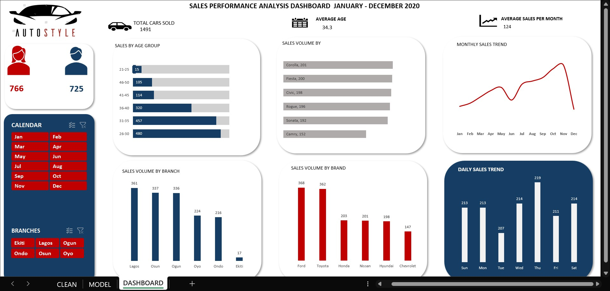
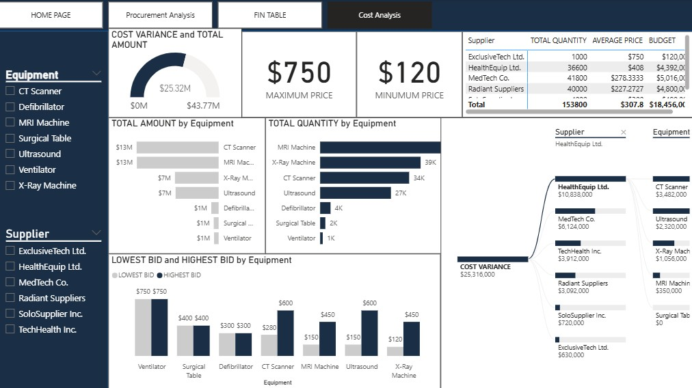

# BIO:
A dynamic and results-driven Data Analyst with a multidisciplinary background in Digital Marketing and Radio Presenting, combining analytical rigor with creative communication skills. With over two years of experience working with data-driven insights to solve business challenges, I specialize in transforming raw data into actionable strategies that enhance performance, optimize marketing campaigns, and support informed decision-making.

Passionate about storytelling through data, I bring a unique perspective shaped by my experience in front-facing media and digital content creation, enabling me to effectively bridge the gap between data science, marketing, and audience engagement.

 
# SKILLS
1. Data analysis skills: Data cleaning and Transformation, Data modelling, Statistical analysis 
2. Technical skills: Scripting languages(Python), MYSQL, PowerBi, Microsoft Excel(for data visualization)
3. Communication skills; Data Storytelling, Reporting and Presentation(using tools like Canva, Powerpoint Power Bi AND Excel)
4. ‌Field: health, security, Finance and sales performance

5. 💻 Digital Marketing Experience

Tools & Platforms: Google Analytics, Google Ads, Facebook Business Manager, Mailchimp, SEMrush

Core Skills: SEO, PPC, Email marketing, Content strategy, A/B Testing, Campaign tracking

Analytics & Reporting: Campaign performance reporting using data visualization tools

Growth Strategies: Conversion optimization, audience segmentation, lead generation

Cross-Channel Integration: Coordinating marketing efforts across social media, email, and web

6. 🎙️ Radio Presenting & Media Communication

Experience: Over (X years) of experience as a radio presenter for (Station Name)

Skills: Public speaking, scripting, voiceover, content scheduling, audience engagement

Notable Work: Hosted live shows, interviewed guests, produced segments covering tech, culture, and trends

Transferable Strengths: Clear communicator, strong presence, adaptable under pressure, excellent storytelling

   
# PROJECTS
* [This project is an analysis done on car sales, view more on github](https://github.com/BAMILAK/CAR-SALES-ANALYSIS)
* [This is a project on procurement analysis, view it on github](https://github.com/BAMILAK/Procurement-Project)
* [This is a project of financial/sales analysis on different variants of Cannabis]() 
*
*
*

  

# CONTACT DETAILS
|[Email me](mailto:jideanjous246@gmail.com)
||[Connect on linkedIn](https://www.linkedin.com/in/anjous-babajide-970703161/)
||Phone No:+234-8089207985
